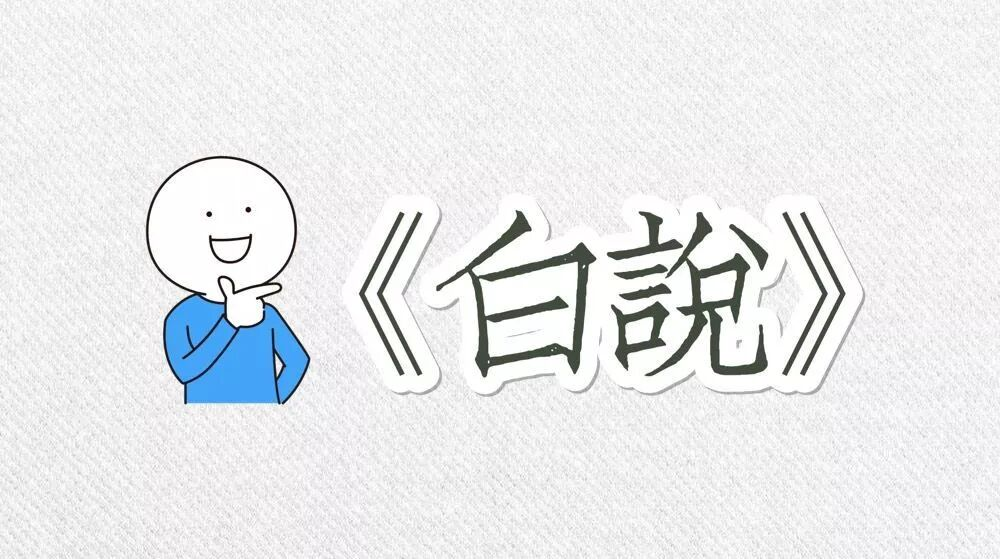
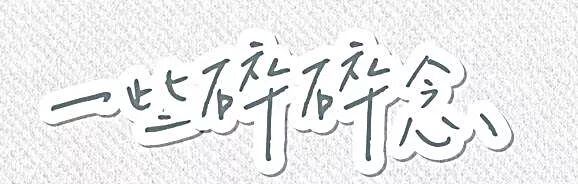
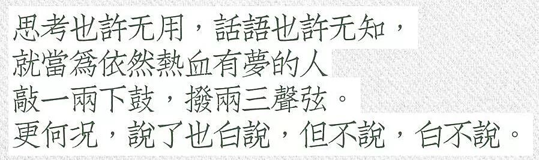
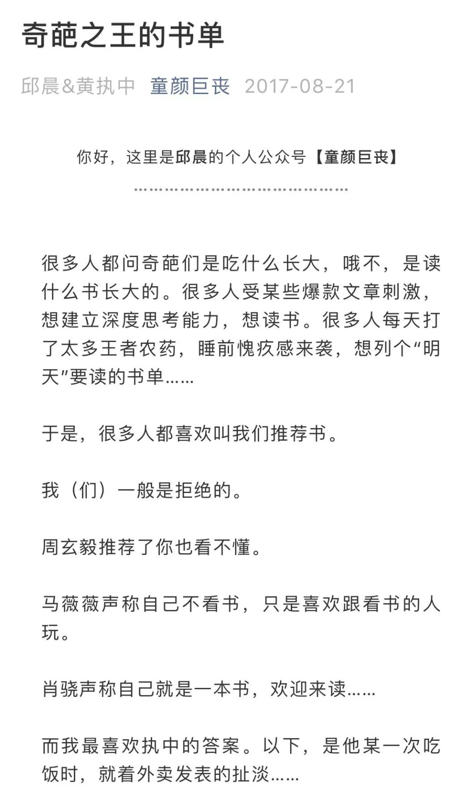
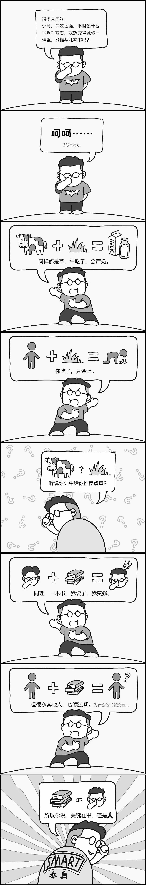
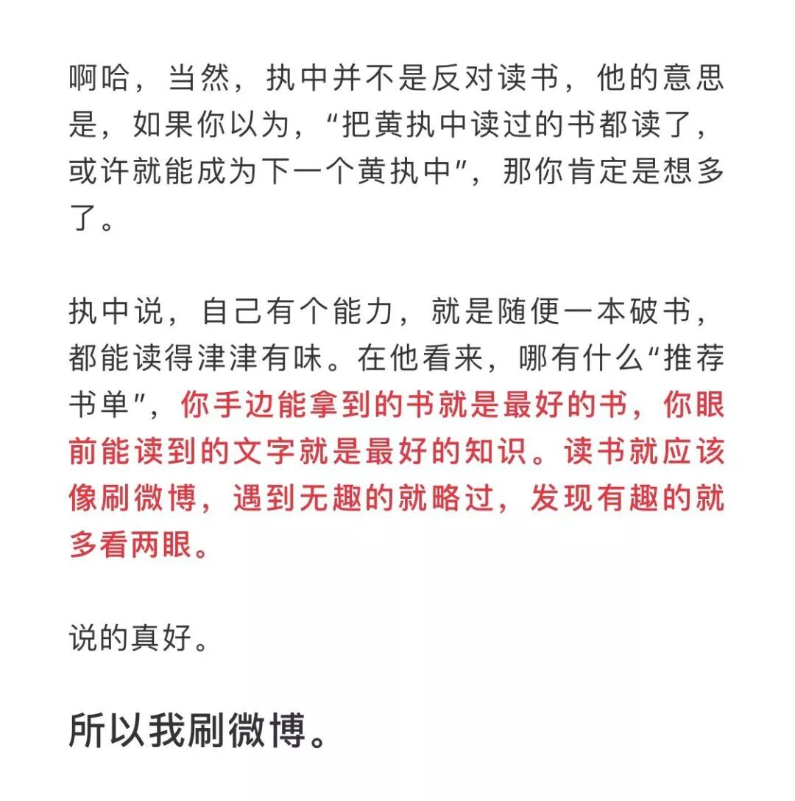
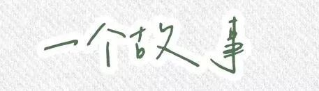
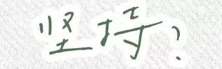

说了也白说，但不说，白不说。

写这篇推之前，去知乎了一波怎么让公众号排版好看一点，于是就下载了这个那个，手机扫码登了不知道多少次微信，看着纷繁复杂的模板和gif图片，突然想到，这些似乎已经远离我写公众号的初衷了。昨天看完书，突然就想把日常卡撤了，公众号还是做一些长时积累的东西吧。哎，善变的女人呐。

于是打开了word，还是word码字舒服啊，心无旁骛，干干净净，一贫如洗...哎，真是个直男呐。

买这本书，不过是和买《自由在高处》一样的心理，多看看时代观察者的书，积累作文素材呗。其实高三根本没有时间看，很多都当作摆设了。

大概很多人也和我一样，所以在优作里用了很多遍的：

这句话，在第11页的序里就出现了。而后面更多值得思考的内容，却少有人提起。那时候的我们，的确是为了赚分数而错过太多了。（想起阿妹有一节英语课上跟我们说的：谁还不是分奴呢？哎 当时还觉得 what..竟会这么卑微吗 直到我们成了这样的人..）

前几日和zyy回想起高二高三，肯定有快乐的时候吧，但大部分的时间居然都在平淡和丧中度过。

现在想来或许和那时候根本没有好好看书有点关系。所以那些纠缠的情绪、无法理解的affairs、难以处理的人际关系，被困在自我建立的小小世界里，永远找不到出口。

作文素材“灌输”式的道理，是无法改变青春时代我们的傲慢与偏见的。那些自以为成熟练达的偏执理解，唯有一以贯之的作者思想能让我们理解，然后自洽。

Anyway，读完这本书，深深被这个来自内蒙古呼伦贝尔的老男人（？）迷住了。（然而百味鸡仍要吐槽：这本淘宝上买的书的纸质实在是太差了..我的灰色荧光笔仿佛在刷水泥地...）

因为内容较分散，就摘抄一些一眼看过去就sparking的能引起思考的句子吧。

没错，这竟然是一篇摘抄。

（在此感谢qq强大的扫描识字功能。）

#问号不意味着答案，但提问是回答的开始。通过这个问号，我起码在一步一步靠近答案。#

#你听说过百分之百的黄金吗？没有吧，99%，99.9%，99.99%，99.9999%...有些事情就像百分之百的黄金，没有绝对的抵达，但可以无限靠近。

（此时脑袋里跳出了许多收敛？有界？有界又收敛or有界不收敛？或许就是无界且收敛吧...哎 不搞了...）

#有很多人问我，哪本书对你影响最大？每个人都想得到一个功利性的结果。“影响最大”一定最有用。但我觉得，除了新华字典，所有读过的书都像是不断汇入江河的涓涓细流，帮助你慢慢成长，变得壮阔、深远。你怎么知道是哪条汇入的溪流让黄河成为黄河、让长江成为长江的？同样，我这一路上汲取了这么多的营养，无法界定到底是哪本书塑造了我。

看到这儿突然想到一篇虫仔的推送：

hhhh我爱虫仔！！

#做人，要有一种心理准备：历史上见，时间上见，不能总是当下见。

最近翻了fzl时期的小号，实在是好笑哈哈哈....那些深夜12点后的“我觉得我是世界上最糟糕的人”的感叹和那时候觉得没人理解的孤独，放在今天来看只觉得 哇 好好玩啊真是个小笨蛋，甚至早就已经忘记了那天悲伤的理由。

突然想到马东有一次偶然提到的#救猫还是救画#可以用“微积分”的思想。或许也是这个道理。

站在时间轴的另一端去想，或许能消化很多当下觉得走不出的情绪。

#二战期间，纳粹德国空袭英国。英国政府秘密印制了三百万张海报，上面写着“Keep calm and carry on”，也就是“保持冷静，继续前行”，印有英国皇家的标志。一旦城市沦陷，政府会将这些海报悄悄散步民间。因为它知道，如果领土被占，无法使用更激昂的措辞。这是冷静的英国文化。

#什么事情一旦需要坚持，也就离进博物馆不远了。

似乎是的，比如说“坚持运动”“坚持早睡”...什么事情需要去坚持了，就意味着不好奇了、不愿意去付出热情、让你觉得痛苦了。

（运动使猪痛苦 哎 真是个胖子）

啊 思维艺术真是“套娃”：先肯定它，再用更高深的思索去否定以前的定义。

（哈哈 套娃这个比喻是在有一个up主视频里看见的：研究一个东西，研究研究这个东西的人的操作，研究研究研究这个东西的人的心理和操作...太真实太准确了）

#名著之伟大从来不在于它所谓的“中心思想”，而在于围绕这个“中心思想”，它拥有太多“人人心中有，个个笔下无”的动人细节，正是这些细节，诠释了种种亘古不变的真理。如果没有罗切斯特和简爱的那番对话，以及无数诸如此类的细节，《简爱》不会在文学史上占据如此显赫的地位。#

#中国教育有一个非常糟糕的地方，就是什么事儿都得有“中心思想”。如果我们看一本名著，只是为了看它的中心思想和故事梗概，《约翰.克利斯朵夫》就不用看了。为什么呢?傅雷在翻译的时候，已经把中心思想写在了五卷本的扉页上:“英雄不是没有脆弱的时候，只不过不被脆弱征服罢了。”#

看到中心思想，就想起无数节小学课和初中课上偷偷放在下面的《课课通》和《名师点拨》....以及我得分永远很低的概括题...

#我对古典音乐的标题有着某种程度的“警觉"，它们很多都是后加的。比如贝多芬的《月光奏鸣曲》，甚至写进了中学英语教科书。如果你认真去听这段音乐，开始的部分的确给人一种置身月夜的感觉，但是再往下听，始终都是这个主题吗?还有贝多芬的《命运》《欢乐颂》，都像刷在墙上的标语一样，被定义，被局限，以至于我现在听贝多芬的交响乐越来越少。当音乐被过分地标题化，过分地凸显“意义”时，“懂”是“懂”了，但反而会出现另一种距离。

#那时的音乐出品人真认真，磁带里附了一份很完整的文案，把这个曲目的每一段旋律乃至哪种乐器代表了哪种情绪全都写出来了。当时觉得挺过瘾——这块代表封建反动势力， 这块代表婚姻受阻，这块代表离情别绪。按照文案的提示听下来，我觉得这音乐我有点儿明白了。但是从此我再听就很腻，因为它拒绝了我所有的联想，音乐要是那么简单，就不是音乐了。

前几天看中央台《一堂好课》讲的是美育，有一个学生问老师：您一直在呼吁美学教育，那我们应该去教育什么样的美呢？那个讲课的中央美院的教授回答：现在的美种类很多，当然我们呼吁的当然是被很多人认可的、规范的美。

这个回答让我觉得很悲哀。

#“道可道非常道”的意思是：能够说明白的道就不是大道。但换个角度想，那时没有句读，所以可以有另一种句读方式：道可，道非，常道。也许当然有可能是错误的，可让人觉得有趣，这样就可以有一个全新的解读：对于同一件事，有人说是可以的，有人说不对，这是常理。

#尽管不一定正确，像是充满辩证法的文字游戏，但我个人认为这样的句读方式也很符合原著的本意。

“道可道，非常道”太神秘了，“道可，道非，常道”就接地气地多。

#“独与天地精神往来。”先生不止一次提到老庄的精神核心。的确，千百年过去，在老子庄子的哲学中，常常让你读出更现代的气息来。老庄之学，是中国少有的充满着自由与民主精神的哲学。可惜，历史长河中，它被习惯性地误读并长久边缘化。

这篇都在说道德经，让我突然想去读它了...and突然想到“道可道，非常道”就是课堂上一直讲的“能够被发现的错误就不是错误”，我总觉得这多少有些推脱责任的嫌疑...辩证法真奇妙啊...

#有人问我，你这辈子追求的目标是什么？我说我追求在我年老的时候，成为我想象中的特别可爱的老头，比如启功、丁聪、黄永玉老头子，或者克莱伯。

看到这儿，突发奇想给zyy发了一条信息：希望我未来某天给你写的信，能像邱晨写给阿詹的那样，而不是堆砌着回忆杀。虽然回忆杀总是必要的。

当然也和白岩松一样憧憬着：希望我能成为一个被女儿喜欢的好妈妈，和能被孙女写进作文去表扬的好奶奶，还幻想着某个阳光明媚的下午给她们讲人生百态hhh。

（灵魂叹息：是否找得到老伴儿都不一定呢...）

#我一直信奉普利策的一句话“记者是社会这艘大船上的瞭望员。”而读书、思考以及责任感的支撑，就是瞭望员的“望远镜”。

#我经常听到一句其实很不愿意听到的话:“白岩松，你胆够大!别人都不敢说，就你敢。”乍一听是表扬，其实是一种误导。说别人“不敢说"，不等于说别人“不能说”，或“不该说”。如果仅仅是敢说，那是练胆大。胆大的人不少，因此出事的也很多。所以开玩笑说:胆，是练出来的。这“练”，是让不断学习成为训练。

#二十多年来，新闻已经成为我的信仰的一部分。我依然相信，新闻能让这个世界变得更好一点儿。如果有一天我不再信仰它了，肯定就不做了。

想到昨天晚上看的心理学研究里的心理治疗方法，发现的确算是我最感兴趣的一部分了，暴力伤医事件之后发的pyq：哎 去学习啦 或许心理学可以拯救世界呢。

虽然有时候总吐槽说心理咨询师就是个赔本买卖啊，请督导培训啥的不知道要花多少钱呢。但心底里总觉得这也算是平凡的我所拥有的一个小小信仰吧。

#前些年给主持人大赛当评委，我经常忍无可忍地点评:“又听到一段流畅的废话。”声音完美，一级甲等，字正腔圆，毫无瑕疵，但是说完了我一句没记住。
都是些什么样的语言呢?“在和煦秋色中，舟山的媒体人和政府新闻发言人，与来自央视的白岩松共聚一堂，在中国梦的大环境下，畅想新闻的美好未来。”
这种“流畅的废话”不少见吧?我称其为“散文联播”。#

#我在《东方时空》受到一个非常简单的训练，但直到现在也不是所有媒体都做得很好。我们对自己只有两个要求:第一不许叫被采访者“老师”，第二去掉解说词当中的“形容词”。

#我们曾经有一个主持人，在采访中称呼对方“老师” 而被扣了钱甚至让制片人勃然大怒。我们当时不理解，后来理解了。他告诉我们你是替观众去采访，如果你把每一个被采访者都称为老师，就等于把这种称调强加给了千千万万的受众，这是不公平的。而不称老师也并不代表不礼貌，真正的尊重是平等。

#至于在解说词中去掉形容词。对于在中国的教育环境下成长起来的人也是一件很难的事。我们习惯于形容一个身高一米八三的“正面形象”拥有“伟岸的身躯”。如果新闻里说“今天的上海祥云朵朵”，大家就会知道接下来一定要报道一个好消息。

#但是对于新闻，形容词是非常忌讳的，因为它在修饰、强调，并且很主观。你不能将经过主观修饰的东西，利用媒体的“暴力”强加给受众。#

在此又忍不住想要批判一波考场作文...详细的批判请参见上上篇...[http://mp.weixin.qq.com/s?__biz=MzU1MzY1MjIxOQ==&mid=2247483693&idx=1&sn=06c9b0ec9dd9229c358fa3d6743bc0e5&chksm=fbeedbb9cc9952afcd85d2c849b59bb5e157c405389ab690b53dc1825d8419b30f68435f0754&scene=21#wechat_redirect](http://mp.weixin.qq.com/s?__biz=MzU1MzY1MjIxOQ==&mid=2247483693&idx=1&sn=06c9b0ec9dd9229c358fa3d6743bc0e5&chksm=fbeedbb9cc9952afcd85d2c849b59bb5e157c405389ab690b53dc1825d8419b30f68435f0754&scene=21#wechat_redirect)

[book思议之《月童度河》](http://mp.weixin.qq.com/s?__biz=MzU1MzY1MjIxOQ==&mid=2247483693&idx=1&sn=06c9b0ec9dd9229c358fa3d6743bc0e5&chksm=fbeedbb9cc9952afcd85d2c849b59bb5e157c405389ab690b53dc1825d8419b30f68435f0754&scene=21#wechat_redirect)

#现在，写一篇洋洋万言艰涩深奥的学术论文，可以让医疗从业人易评个更高的职称;写十篇通俗易懂、普及常识的千字文，却不会给他们带来任何利益。这样的评价体系本身就有问题。#

#面向大众的科普，有时比专业领域的科学研究更难。我永远感谢和尊敬那些在各行各业致力于科普的人。科普科普，首先你要明白科学，然后还要明白普及，能将这两者结合在一起的人才少之又少。

#因此相应的人才评价体系应该做出改变，允许我们的医生离开诊室三个小时，做一些便于传播的科普工作，或许会减少未来每天三十分钟的门诊量。

#在远方，我们也已做得很好，即使是去非洲，志愿者们也争先恐后地报名。但是身边呢?开个玩笑，老人跌倒了都没人扶。

#“身边志愿精神”的欠缺，的确是当下中国志愿者活动的组织者必须思考和面对的，如果我们不能把大型的、成功的志愿服务成果演化为生活中普遍的、具体的志愿服务，如果我们不能把对远方的向往转变为对身边的关注，志愿行动的终极目标又是什么?

#曾任团中央书记处第一书记的胡春华说过:“归根到底，我们是要把志愿服务的行动，逐步演变为志愿服务的心。”这句话我不止一次在节目中引用。将奥运会、世博会、亚运会等大型项目中培养起来的志愿精神，转移、分解到身边的小事中去，比如帮助留守儿童、残疾人、老人，这才是未来中国的重要命题。

看吧，这又是一次套娃。

#总有人愿意说起上个世纪五十年代的中国，“民风淳朴，路不拾遗，夜不闭户。”对不起，也许路不拾遗和夜不闭户，是因为实在是没什么可偷的。#

想到长辈们总会说“你们这代啊就是掉在米缸里的小老鼠 长在甜水里的”，而我们这一代又会羡慕上一代人无忧无虑，像飞飞一直说的钓钓小龙虾、摸摸鱼的童年。

真是不可也不必同日而语啊。时代的改变，是伴随着收获，也伴随着代价的。

#很多年前，龙永图告诉我:“谈判是双方妥协的艺术。”人生就是一场谈判，与梦想谈判，与时代谈判，与身体谈判，要懂得有所妥协。这个世界上从来没有百分之百的纯金，又有谁可以圆满地实现理想呢?进一步，再退半步吧。任何一个时代，所谓的终极目标，永远无法达成。

国家发展改革委的朋友也要明白，你殚精竭虑地付出一生的努力，时代的病状依然不会彻底消除。每个阶段有每个阶段的问题。唐朝、宋朝、清朝都曾是盛世，但如果你能穿越回当时那些知识分子云集的酒馆,会发现他们也同样忧心忡忡。忧心忡忡是知识分子的天然使命。

中国这列火车，我们希望它朝着正确的方向走。但是别忘了，一定有人拦在车的前面把它往回推，也有人在侧面瞎推。更可气的是，还有相当多的人，坐在车顶上，事不关己。这是一一个非常残酷但必须接受的现实。好，我们接受。但在接受的同时，确保自己是向前推动的人群中的一分子就好了。

wow 这段话作为结尾似乎很不错。

那么 下次再见啦。
