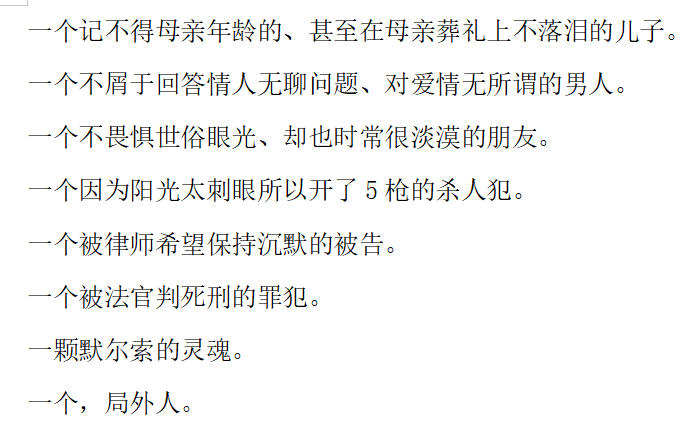
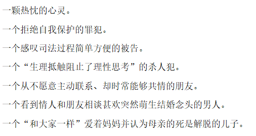
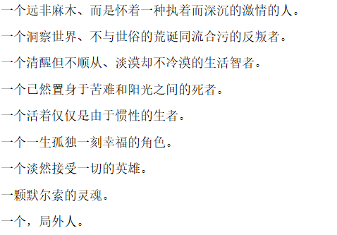
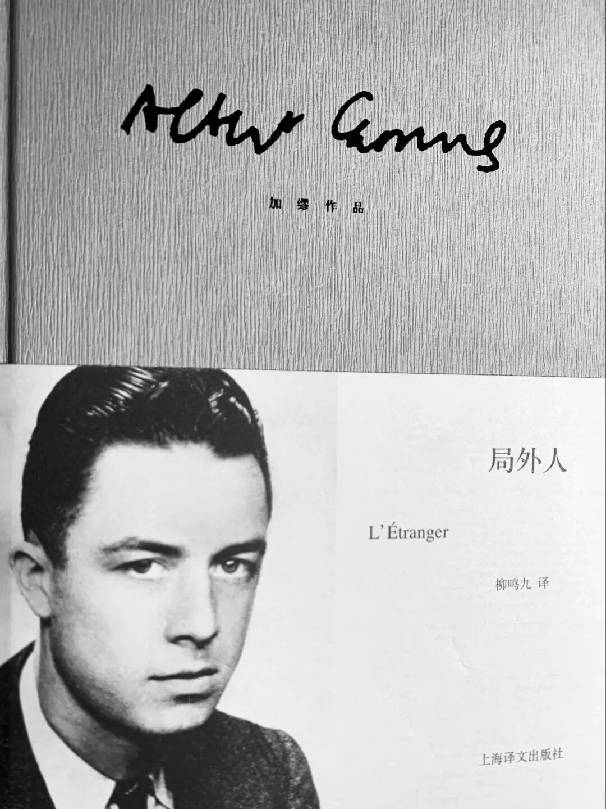
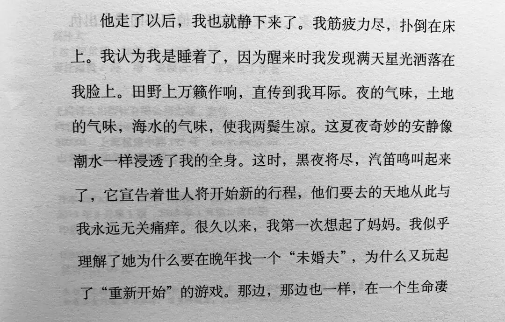
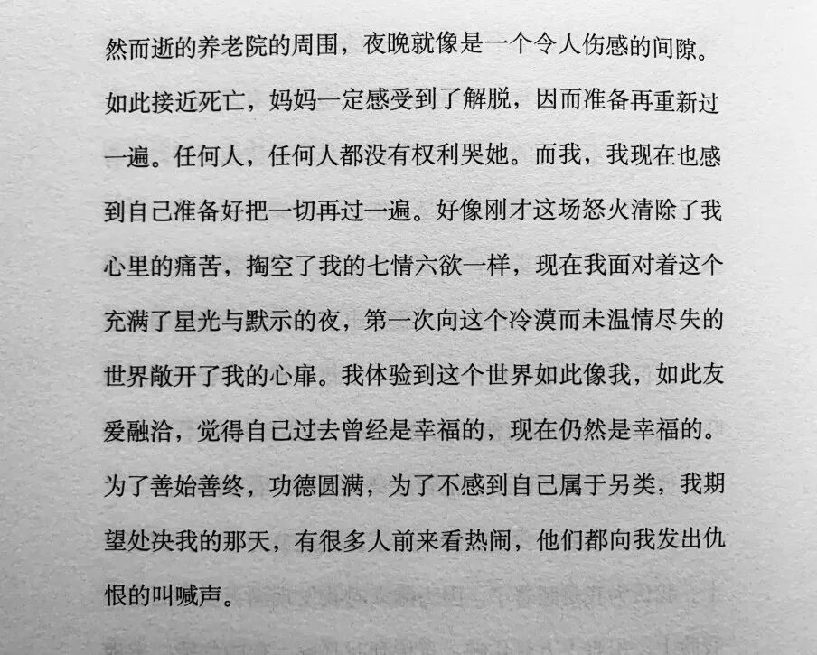

book思议之

**「局外人」**

一颗默尔索的灵魂

（——突然拥有了一个灵感...于是）

**showtime**

#好吧...皮这一下很开心（个头..凹字数实在痛苦...)

**他**

的确，如你所见，

默尔索的反叛和挣扎，性格里的冲突和矛盾，

让每一个读者都无法给他定性。

他太独特了，甚至觉得，他离我们很遥远。

大概是因为。

现代人预设的自己已经不再是他本身，而是一个社会观念的产物。

人们不愿意放弃这个观念，本性又是不可改造的，所以就陷入了悖论。只要你不放弃那个矛盾的前提，任何解决悖论的努力都是徒劳的。

我们是没有办法的。

社会观念一代一代的流转变化，似乎滚烫地灌入我们这一代的头脑里，但是冷却之后，其实皆为惘然。pluralism的确存在，但这永远也无法动摇上一代的人观念。这一点看似只是小小的一环，但对我们来说却失去了绝大部分的筹码。

但默尔索不是。

所以，其实我们都有默尔索的灵魂。

但我们，永远不可能成为默尔索。

是怎样怎样的孤独裹挟着我们，是多么多么深切的渴望引领着我们...写这些东西来给我们的无力感一点点慰藉或许在这篇里就不必了。毕竟，也已经看了、写了很多了。其实，谁不清楚呢。所以我总觉得理想主义是藏在心底里的，所以每次辩论上这方面的价值都觉得枯燥乏味。

但总有人会说的。

并且。总是需要有人去说说的吧。

邱晨说自己：丧的很燃烧。

（我太喜欢邱晨了！我觉得她的每句话都说的好对...或许不是个好现象...8过真的很对啊hhh）

看了她的微博和采访，她这么说自己大概是因为，她从来都觉得这个世界很糟糕、荒谬，会无力会绝望，但是依然愿意去思考去表达。就像《银河补习班》里一直说的嘛：keep thinking。

“我想告诉你，在我们共同生活的那个宇宙里，我和你一起，用这一生的思考，去对抗过这一整个时代的鸡血的鸡血和鸡汤，那正是在那个宇宙里，那一辈子做过的，最了不起的事情。”

（天哪 我怎么又在打这段话了 活爹给阿詹的信真是千千万万遍 每一个停顿都太有味道了 现在看虫的微博都能想象出她说那些话的语气 aha太迷人了）

由于对虫仔的迷恋严重影响了这一段的思路。

以及母亲刚才抬来的没有韭菜的韭菜盒子过于好吃。

fine，这一段就这么仓促的结束了...

**正义？**

故事过于简单，甚至没有分支，127页的书很快的读完，并不觉得畅快。这种心情，和看完Chicago的反应差不多。最大的失落是，这种事情，的的确确在发生着。

#这时，我注意到大家都在见面问好，打招呼，进行交谈，就像在俱乐部有幸碰见同一个圈子里的熟人那样兴高采烈。我也明白了自己为什么产生了一种奇特的感受，觉得我这个人纯属多余，有点像个冒失闯入的家伙。#

陪审团里没有一个人在乎默尔索过失杀人这件事情的事实细节、前因后果，甚至没有人在乎默尔索，而只在乎默尔索本人之前的日常而企图去概括出他的品性。

就像是现实里漫天的“你行你上”“带节奏”“蹭人血馒头”...这些人关注的重点根本不是事情本身，而是与之根本没什么关联的所谓的爱国情怀、所谓的理性、所谓的维稳、所谓的正确节奏。

——用一个人改变的行动缺失，去否定改变的意愿。用个体的无能为力，去否定言语本身的价值。

哎，这种逻辑真的很奇怪。

多说无益，越说越气，越看越腻。

又扯远了，不知道在说啥。

于是再次任性的想结束就结束了。

**荒诞**

读完后还觉得：这本书好看，但并不好读。大概是由于加缪对语言进行的特别的处理。若是不加任何思考的看情节，一定会少掉很多刺激感和代入感。

在这本小说里，加缪始终以一种单调到枯燥、毫无内在逻辑的叙述语言，甚至陌生的遣词造句法将读者拒之故事之外，似乎不断地提醒且迫使读者产生阅读上的距离感和隔膜感，感受到自己是局外人。

不愧是加缪啊。

有谁能抗拒加缪的魅力呢。

他说：荒诞感可以在随便哪条街的拐弯处打在随便哪个人的脸上。

**希望**

关于这本书，似乎只能想到这么多了。

最后，就用很多人基本上要反反复复品味好几遍的结尾作结吧。

或许看完，又会爱默尔索一点吧。

啊 一颗默尔索的灵魂。

