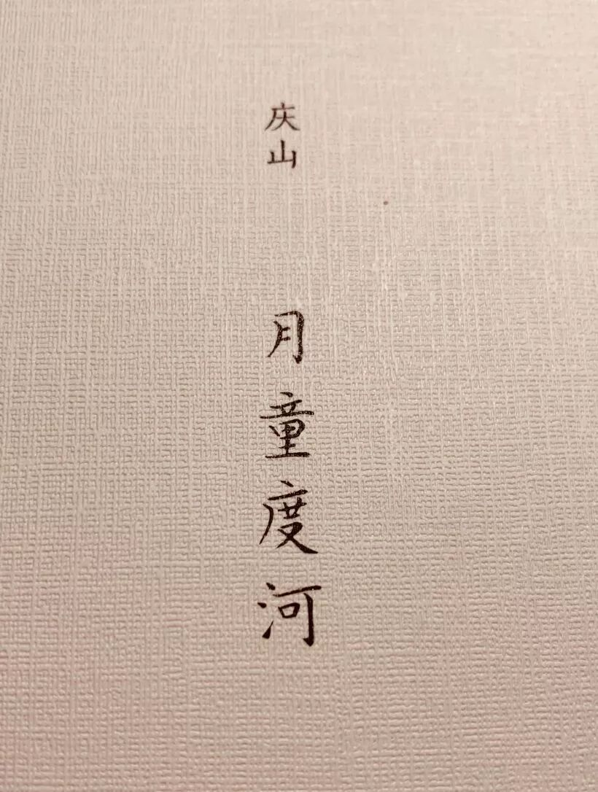
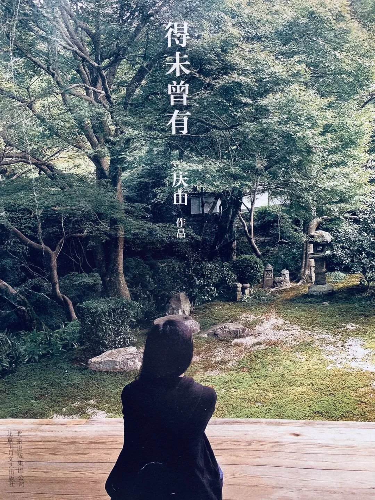
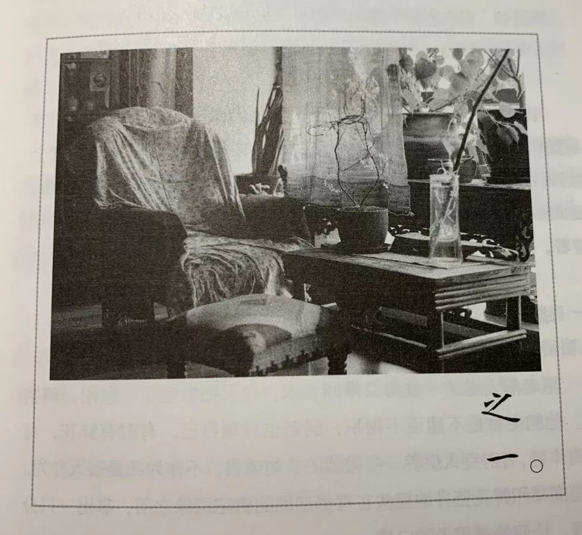
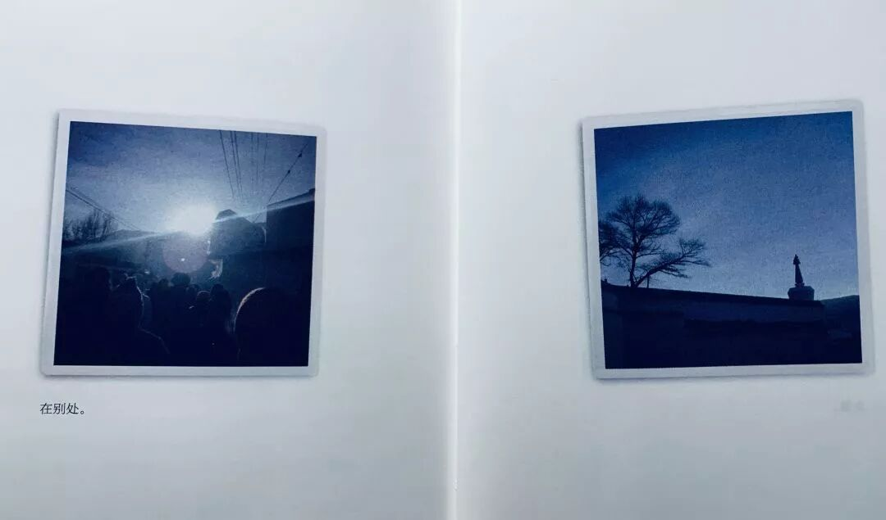
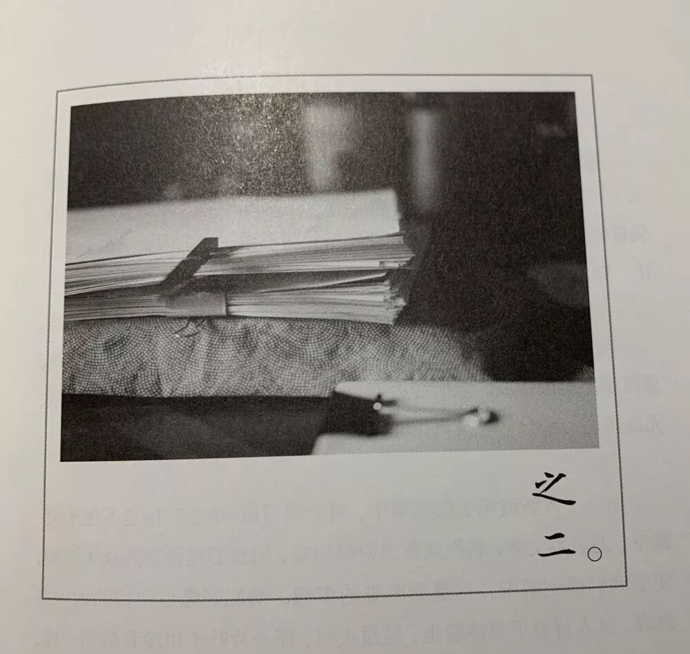
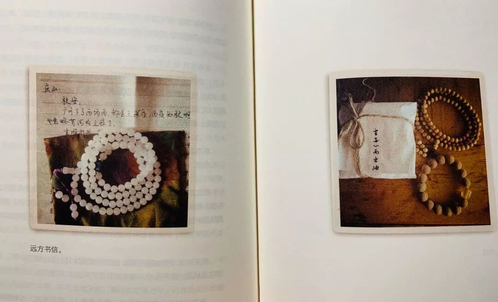
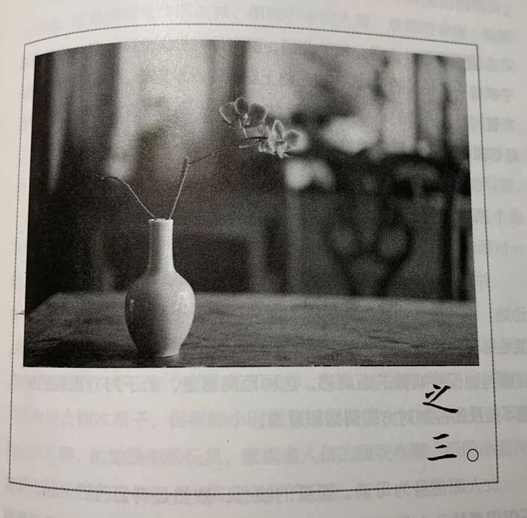
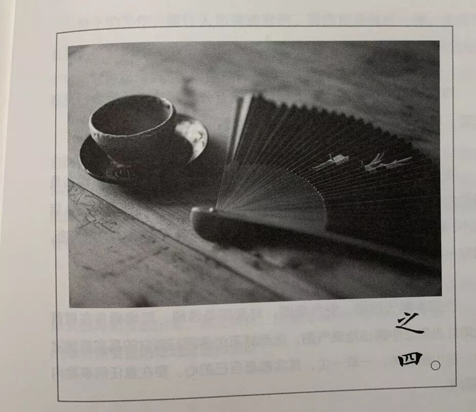

book思议之

**《月童度河》**

既然是一本散文书，那么它的推就不要管什么逻辑了。fine，碎碎念也挺开心的。

0

初中里ff强烈安利《得未曾有》给我，似乎永远忘不了那个时候酷爱许嵩的ff，也忘不了《得未曾有》给迷惑初中时代带来的沉静。（anyway 过了不久又开始迷惑了...放学回家第一件事情就是使用金枪小帅玩天天酷跑。 ff是个特别的姑娘。时至今日或许都没有人能够理解她。）

后来读了《眠空》，疯狂摘抄，在作文里故作深沉的引用。

现在读《月童度河》，只是躺在躺椅上看一整个下午，无人打扰，也不必立马摘抄。傍晚，妈妈去阳台收衣服，帮我把窗帘拉上遮住夕阳刺眼的光芒。默默地，并无交流。

是不喜欢考场作文的。如今想起那些得了高分的考场作文，只觉得可惜，每一次登上优作都觉得荒唐。不喜欢写好听的文字，不喜欢突然引用我根本没有看过的书和了解过的作家，不喜欢用文艺的话盖过观点而获得一个“文笔优美”的评价，不喜欢取悦阅卷老师。不喜欢。当时考虑复读的时候想到还要写一年的考场作文，只觉得窒息。

1

如果说《百年孤独》是跟随着马尔克斯的上帝视角观察人物，那么《月童度河》则像是在听一个远方的朋友诉说她最近的变化和想法，一点一点的，慢慢的诉说着。

没有看过安妮宝贝早期的书，也就没有见识过“棉布衬衫 光脚穿跑鞋”等等被tc了很多遍的叛逆意向，只知道像《七月与安生》那样的故事我是不喜欢的。凭着读她的一点点作品，觉得她适合写散文甚于小说。

她的文字有一种很珍贵的真实感，毫无刻意的正能量负能量，都是她在那个阶段 那个时刻所思所想的全部。并且得出的观点是有过程的，不像为应付考场作文而读的散文书里直接呈现一个看似无懈可击的观点供人摘抄。（我真是无数次diss考场作文 真是恨透它了...）

想了很久这种风格像谁，今天突然想到了，有一点像《我与地坛》里史铁生的风格。（毕竟史铁生的书我只读过一本 也不知道他其他书是什么风格 哎 ）他们的共性在于他们不动声色地把情绪燃烧成液体灌注到每一个句子里，让你觉得浑然天成而不刻意做作。

such as：

“湖边一处木结构平台，晚上自发的舞会。有人放出音乐，人群跳起交谊舞。母亲跃跃欲试，说这个舞步她也会。我说，你去跳。她略带羞涩，推搪一番，才把手中的拎包递给我，脱下外套,即刻身形灵敏汇入人群中。很快放开自己，神情自如地跳起舞来。夜色中的西湖灯火阑珊，山影起伏。空气中有树叶的香气，水波的腥味。幼小女童无所禁忌，不等大人指令,早已天真烂漫挤入人群，一边发出咯咯笑声。清脆的笑声仿佛会把空气撞碎。
      我等在旁边，手里抱着母亲的包和外套。看着她们两个尽情玩耍, 一时有些恍惚，眼角渗出泪水来。这个老去的女人是母亲。这个生长的孩童是女儿。”

这种微妙的渗透感在于，文中并没有任何情感的直接抒发，但是却让读的人感受到一种很干净纯粹的温馨氛围。或许这就是东方人特有的那种似乎疏离但又紧紧联系着的亲情关系。

她自己说道：那些多愁善感的阶段已然结束。在没有柔肠寸断、你死我活。有时也会陷入情感圈套，但思路还是像刀锋般冷硬、直接。

她引用道“一位作家的深度，得由穿透作家心灵痛苦的深度来决定。”

她说：这里所依赖的，不是痛苦的深度，而是穿透的深度。这是有区别的。

看到那个曾经陪伴过自己的远方朋友一直在成长，这是一件幸福的事情。其实何止是阅读，现实生活中也是这样的。

2

社团的面试单里写着：喜欢写文章，但心里也明白除了作文已经很久没有写长长的东西。有时候写了个开头只觉得文笔枯竭，毫无灵性。在wb偶尔灵光一现写点东西，最终也是趋于娱乐化。或许是没有找到宣泄的出口，寒假里突然想到了公众号这个东西，现在瞎写写东西，小日子甚是满足。

她说：写作是为了给遥远的另外的自己。是比现实生活中的自己，更纯粹真实的存在。也可以说是我们自身隐藏的佛性和神性，写作可以联结到它。

当下，觉得没有什么东西，能像写作时探索自我那般真实、深刻、久远而又热烈。

3

不知道从哪里看到的提醒：不要把任何电影截图当作是真理，不要把任何一个人的某句话奉为圭臬。任何的电影截图和只言片语，都是有特定的情境和特定的情绪的。真正的道理，往往都是一条绵长的路。

想起在那些自以为成熟练达的岁月里，从qq跳到微博，转发一些”马男波杰克”“三只裸熊“的语言cut，又想起最近看到有人转发一些我需要和别人讨论才能读懂的话，想来真是没有必要。然而当今的环境依旧是这样：只言片语毫无营养的废话，转发无数。有真知灼见的地方，寂寥冷落。

揣测当时的自己，或许是还带着青春期想要标新立异的虚荣心，自认为内心世界的情感无人可知，而当某个电影截图恰好出现，仿佛觅得知己，于是不加思考，速速转发。

她说：所有人都是一样，在各自粉饰的外表下有着千疮百孔的人生和深渊。如果了知这些，不会觉得特别，也不会觉得无辜。

她说：任何人不要觉得自己特别，或有多重要。在这样的时代，就越要用心的探索和表达，逆流而上。

她说：花好月圆的平衡与充满是有底气的，也是看起来极为平凡的。二十几岁喜欢复杂、渴切、执着的人。现在若是看到一个人，平心静气、眼神澄净、爽爽朗朗，觉得这样很美。

与自己长期以来的错误习惯和认知抗争，是一件艰难的事情，同时也是必要的事情。

4

关于记录这件事情。看了很多的观点，无法达成一致。

她说：很多事情没有及时记录，有时候也安慰自己，一旦某天需要，强烈的信息渗透身心，必会自然涌出。但事实并非如此。若不尽快记录、整理，所有当下，都会瞬间成空。

的确是这样的，写年终总结的时候，翻看上学期那三两天写一次的日记本，还是得到了一些灵感。有些事情，若没有文字的记录，的确很容易淹没在那些最清楚的记忆里。

然而关于手账和pyq的意义，以及如何权衡微博知乎b站的用处，至今没有相通...哎

于是我在企图再想想的时候，突然又被拉去做网辩主席了...拖延战术失败，悲伤。

fine，那么也就碎碎念到这里了。

明日读久仰大名的《穷爸爸富爸爸》。

再见~

（图片实在是缺乏 maybe我应该去收集一些美图）

看到这张图片 突然想吃乐事了😭
