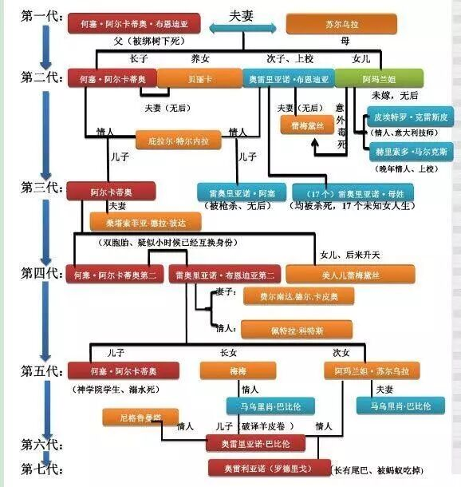

**只不过是百年的孤独**

Many years later as he faced the firing squad, Colonel Aureliano Buendia was to remember that distant afternoon when his father took him to discover ice.

（多年以后，奥雷连诺上校站在行刑队面前，准会想起父亲带他去参观冰块的那个遥远的下午。）

肺炎肆虐的日子里，心如止水的在家看书，突然发现自己小时候错过了很多的经典。但话又说回来，一期一境嘛，每个时期都有和你契合的东西出现，没必要懊悔什么。突发奇想决定每看完一本书就做一篇推送，让自己的阅读有迹可循。（害  也不知道能坚持多久...）

《百年孤独》的确是在书架上摆了很久，想起高一军训的时候在闲来无事的晚自习时读过，第二天就把前一天看到的人名全忘了，qzh曾质疑我都记忆能力，后来他也orz了...于是突然就理解了平平高一的时候说过，这么爱书的她却从来没有看完《百年孤独》...

所以我可以概括为：《百年孤独》是一次奢侈的阅读。

或许也只有大学里有这种机会了吧。哎，得好好珍惜才是。

第一个下午（哎 当然是因为 一觉醒来就是中午...）以龟速看完了80页。当时只能用短句描述我的感受，因为我实在是 。震惊了。

看的时候跟着马尔克斯的上帝视角去观望这个家族百年的命运轮回。除了“荒谬 悲哀 我的天 宿命啊。”基本上书上就没什么其他字眼的批注了。

似乎是很多年都没有这种阅读体验了，似乎总是一目十行的看完，想要尽快的汲取内核充当作文素材，却总是忽略了情节的构思、人物的刻画。似乎已经很久没有像这本书一样，让我一字一句的去感受其中的文字了。

实在是，魔幻的合情合理，荒谬的恰到好处，又真实的yp。

看完全书，触发了对各个点的思考，复杂又混乱，看了知乎，才理清楚了一点点这本书对我的冲击。

（maybe这就是看名著的意义。可以收获更广阔更丰富的真知灼见，这样收获也是成倍的。）

叙述手法

感受出了这本书叙述的非同寻常，但是一直找不到合适的话去表达，直到我偶然间打开了下载了很久的漫威无限app，随便打开了美队的漫画，惊讶的发现原来看漫画的切换居然如此神奇。

选用分屏模式，漫画被切割成一块一块，就好像用放大镜变换地方的探索一样，每一个细节都尽收眼底。这个时候，情节似乎没有那么重要了，每一点细节的刻画就足够吸引人。

于是今天也在知乎上找到了合适的描述orz...博学的大神真是tql！！引用如下：

“传统小说与戏剧有着相同的血脉，它通过一个又一个“起因-冲突-高潮-回落”的结构，驱动文本的前进和发展。有时这种结果偏线性，如卫斯理式的科幻（好的 我不认识）；有时，这种结构则是环状的，如金庸所著的几部长篇。（好的 我没读过..）

这种以情节为文本主要驱动力的小说，有效地吸引了读者的兴趣，使读者不自觉地跟随文本的脚步进行阅读。

但这种方式面临的是一个自身无法解决的问题：读者为了追逐情节，找出悬念背后的真相，会在阅读者不可止遏的发足狂奔，于是文本中的细节被忽略。作品中着力表现的人物形象、个体特征在读者眼中，都只剩下模糊的轮廓。当读者终于面临作品的高潮，迎来作品的结局之后，就再也提不起精神，重新细品这部作品了。（这说的也太好了orz）

而一个有野心的作者，远远不止满足于此。

他们通过种种方式，去消解文本的情节驱动力。所以当我们进行阅读的时候，我们的阅读行为不仅仅是一直苦苦追逐悬念和高潮；而是能动地挖掘一些潜藏得更深层次的东西，在文本中文本外，引发出多一点点的思考和回味。小说不再是一条单程的高速公路，它有了回廊，有了屏风，有了层次。

他们致力创造的，不再是一本阅完即弃的一次性产品；而是一本能在真正意义上能反反复复激起读者阅读兴趣的书籍。”（ 说的太好了...除了深深respect我真是...哎...）

或许这样的叙述方式，就是我不对那些重复相似的人名感到厌烦、而能够以持续的热情读下去的原因吧。

有生之年，一定会读好几次的。

（附一张大神理出来的人物关系图 再次orz...我读的时候到底经历了什么...）

fine，有些书适合每日看几页，细细品鉴其词句，但有些书适合一气呵成地看完。《百年孤独》无疑属于后者。

“作者刻意将角色们的名字写得那么接近，一是为了显示家族百年的宿命感，二也是不想让读者纠结于某个具体的名字而影响整本书的连贯与流畅。读后掩卷，作者希望你记住的不是家里复杂的家谱，而是太阳底下亘古不变的人世循环，是爱恨，是挣扎之后的无力，和绝望后却突然在尘埃中开出的满世界的黄花。”

描写方法

又是词穷的不知道怎么夸马尔克斯描述人物的那种细腻与残忍，那么就找几个例子吧：

“这个天赋异禀，自称掌握了诺查丹玛斯之钥的人是个阴沉的男子，裹在一团愁云惨雾里，谜一般的目光仿佛能看透一切。他总戴着一顶黑色大礼帽，活像乌鸦展开的翅膀，身穿一件天鹅绒坎肩，染着沧桑岁月的苔印。”

“奥雷里亚诺那时只有五岁，他一生都记得，那个下午吉卜赛人如何坐在窗前金属的反光中，用管风琴般深沉的声音揭示最幽暗的想象地狱，热得沿太阳穴流下油腻的汗水。”

“远征者们在船内仔细探查，却发现里面空无一物，只见一座鲜花丛林密密层层地盛开。”

“这一把把泥土使唯一值得她自卑自贱的男人不再遥远也更加真切，仿佛从他脚上精巧的漆皮靴在另一处所踏的土地传来矿物的味道，她从中品出了他献血的重量和温度，这感觉在她口中猛烈灼烧，在她心里留下安慰。”

“她辛苦多年忍受折磨好不容易赢得的孤独特权，绝不肯用来换取一个被虚假迷人的怜悯打扰的晚年。”

好吧...打字打不动了，就列举到这里吧。

单从罗列出的这几个句子里，大概就能模糊的感受到所谓魔幻现实的特点。

在超越常理的力量的作用下，可以轻易的让读者看到尽头、无穷这种在现实世界里不着边际的概念，也可以更轻易地让读者感觉到彻骨的绝望。有时，却也会突然的温柔。那种“已识乾坤大，犹怜草木青”的温柔。

...或许描写这种东西，只能自己去感受吧。

突然结束

装模做样说我真的参透了百年孤独真是duck不必，或许这一期推送，就应该结束了。

诚实地说，看完书的最后一个字，好像做了一场绵长的梦，荒唐又真实，有一种宏大的却难以名状的心境。但是真的让我去总结出什么成文的主题，是真的不会。

而最近的社会现状却让我有了一点点对于魔幻和现实的体会。

魔幻离不开现实的框架。但单调的现实也正是因为有了天马行空的魔幻色彩而增添了可能。

所以“魔幻就是现实”这句话所构建出来的世界是好的吗？至少从现在看来，它并不好，它甚至让每一个群众心寒到细思恐极、瑟瑟发抖的地步。

但期盼这句话的正面影响，或许就是陈铭那句“亮一寸有一寸的欢喜”背后的期盼和支撑着面对现实的荒唐却积极向上的我们的那股强大的力量啊。

即使我们用力的看着

却总在担心所见之处 皆为朦胧

又怎样呢

至少我们用力的看着  这件事情本身

就已经超越了那些得过且过的人啊

“过去都是假的，回忆是一条没有归途的路，以往的一切春天都无法复原，即使最狂乱且坚韧的爱情，归根结底也不过是一种瞬息即逝的现实，唯有孤独永恒。”

就用这本书里很有名的一句话作为结尾吧。

希望每一个人都能享受自己的孤独

并守护自己心底里珍贵的理想主义吧。

